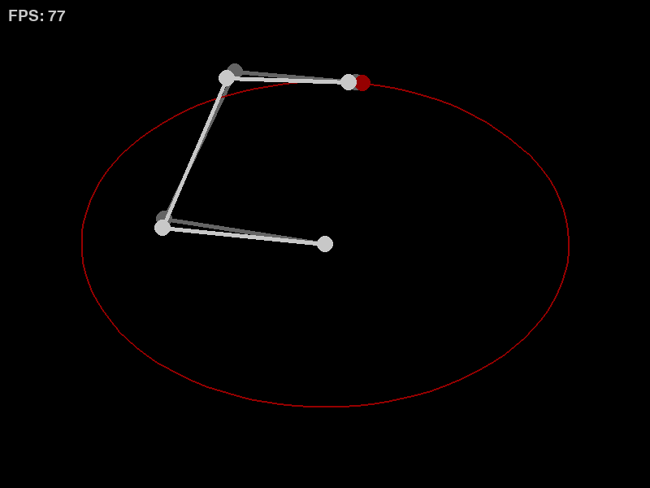

# Robot Manipulator Simulation

## Current Features:

- Object-oriented design
- Manipulator consisting of revolute joints defined by the Denavit-Hartenberg
  convention
- Forward kinematics and jacobian computation based on Denavit-Hartenberg
- Reference trajectory found with inverse kinematics using both position and
  orientation. Computed numerically with Newton's method and the computed
  jacobians
- Simulated dynamics derived symbolically with SymPy and Lagrangian mechanics
- Numerical integration based on explicit Runge-Kutta methods
- Trajectory tracking with various implemented controllers
- Rendered in 2D with Pygame

    
    
Simulation running in PyGame. Target trajectory in red, IK-computed joint references in grey and actual joints in white.

